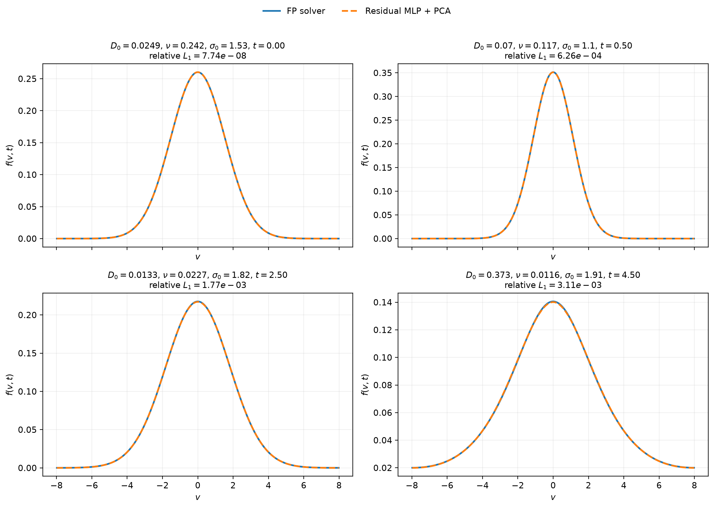
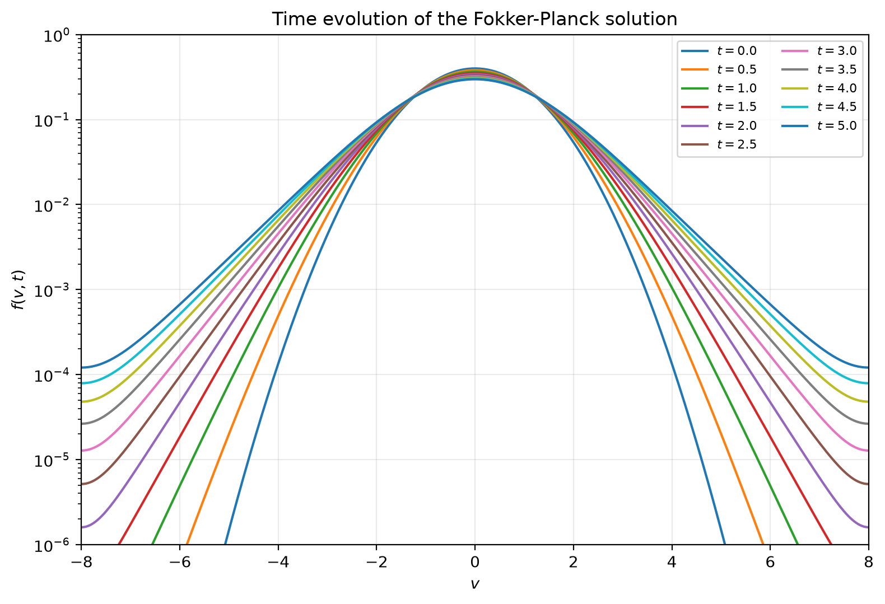

# VIML Fokker–Planck Surrogate

**Version 1.1** · Virtual Institute for Machine Learning (VIML)

A compact scientific-ML workflow for solving a parameterized one-dimensional Fokker–Planck equation, compressing its solution manifold with PCA, and learning a fast neural surrogate. Version 1.1 includes an initial-condition-aware residual MLP that reproduces held-out solver solutions at approximately the `10^-3` relative-`L1` level across the sampled domain while enforcing the initial condition by construction.



## Overview

The numerical solver evolves

$$
\frac{\partial f}{\partial t}
= -\frac{\partial}{\partial v}\left[A(v)f\right]
+ \frac{\partial}{\partial v}\left[D(v)\frac{\partial f}{\partial v}\right]
+ \nu_{\mathrm{coll}}\left(f_{\mathrm{eq}}-f\right),
$$

on a uniform velocity grid with zero-flux boundaries. The solver uses a conservative Chang–Cooper discretization for the transport operator and an exact BGK relaxation step for the collision term.



*Example time evolution of $f(v,t)$ produced by the numerical solver.*

The v1.1 surrogate dataset uses

$$
A(v)=0,
\qquad
D(v)=D_0\left(1+0.1v^2\right),
$$

with a unit-normalized Maxwellian for both the initial and equilibrium distributions,

$$
f(v,0)=f_{\mathrm{eq}}(v)=\mathcal{M}(v;\sigma_0).
$$

The sampled physical parameters are

| Parameter | v1.1 range | Sampling |
|---|---:|---|
| `D0` | `1e-2` – `1` | log-space Sobol |
| `nu_collision` | `1e-2` – `1` | log-space Sobol |
| `sigma0` | `0.5` – `2.0` | linear Sobol |
| `t` | `0` – `5` | 51 saved times |

The default production library contains **5,000 independent trajectories** on a 400-cell velocity grid spanning `v = [-8, 8]`.

## Scientific-ML pipeline

The project is organized as a reproducible sequence:

1. **Fokker–Planck solver** — generate conservative, positive numerical solutions.
2. **Trajectory library** — sample `(D0, nu_collision, sigma0)` with a scrambled Sobol sequence.
3. **PCA compression** — fit the PCA basis only on training trajectories.
4. **Direct MLP baseline** — map standardized physical inputs to 16 standardized PCA coefficients.
5. **Residual MLP** — encode the known initial condition directly into the surrogate.
6. **Held-out diagnostics** — evaluate reconstruction error versus parameters, time, and parameter-space boundaries.

The residual model uses

$$
z(t)=z_0(\sigma_0)+\frac{t}{t_{\max}}\,g(D_0,\nu_{\mathrm{coll}},\sigma_0,t),
$$

where `z` denotes the 16 retained PCA coefficients and `z0(sigma0)` is computed directly by projecting the exact initial Maxwellian onto the PCA basis. Therefore

$$
z(0)=z_0(\sigma_0)
$$

is satisfied by construction rather than learned approximately from data.

## v1.1 results

The bundled residual checkpoint was trained with 5,000 trajectories using an 80/10/10 trajectory-level train/validation/test split. The MLP architecture is

```text
4 → 128 → 256 → 256 → 128 → 16
```

with GELU activations.

For the held-out test split, the saved v1.1 training summary reports:

| Metric | Value |
|---|---:|
| Median relative `L1`, all saved times | `1.68e-3` |
| 95th percentile relative `L1` | `6.10e-3` |
| Maximum relative `L1` | `2.51e-2` |
| Median relative `L2` | `1.37e-3` |
| Median relative `L1` at `t=0` | `2.38e-8` |
| Best validation MSE in standardized residual-PCA space | `1.65e-4` |

These metrics compare the residual-network reconstruction with the retained 16-component PCA representation of the held-out solver snapshots. In this setup, the 16-component PCA reconstruction error is much smaller than the neural-surrogate error, so the reported test error is dominated by the learned mapping rather than PCA truncation.

### Numerical caveat

The PCA decoder is linear and does **not** impose positivity on the reconstructed distribution. The v1.1 summary therefore contains a small fraction of negative reconstructed grid values in low-amplitude regions. The conservative FP solver itself preserves positivity to numerical tolerance. A positivity-preserving latent/decoder representation is a natural direction for a future release.

## Repository structure

```text
viml-fokker-planck/
├── analysis/                  # held-out error diagnostics
├── checkpoints/
│   └── residual_v1.1/         # lightweight pretrained residual checkpoint
├── dataset/                   # trajectory generation / inspection / ML dataset prep
├── figures/                   # selected project figures
├── mlp_model/                 # direct-MLP baseline
├── mlp_residual_model/        # physics-aware residual surrogate + inference CLI
├── pca/                       # PCA fitting and reconstruction analysis
├── solver/                    # Fokker–Planck solver and numerical tests
├── CHANGELOG.md
├── CITATION.cff
├── LICENSE
├── VERSION
├── requirements.txt
└── requirements-dev.txt
```

Generated HDF5 datasets, PCA models, prediction arrays, and training outputs are intentionally excluded from version control through `.gitignore`.

## Installation

Python 3.10 or newer is recommended.

```bash
git clone https://github.com/Virtual-Institute-ML/fokker-planck-surrogate-model.git
cd fokker-planck-surrogate-model

python3 -m venv .venv
source .venv/bin/activate
pip install --upgrade pip
pip install -r requirements.txt
```

For development/tests:

```bash
pip install -r requirements-dev.txt
```

## Quick start: use the pretrained residual surrogate

The included checkpoint can be used without regenerating the training dataset:

```bash
python -m mlp_residual_model.predict \
  --d0 0.1 \
  --nu 0.1 \
  --sigma0 1.0 \
  --time 2.0 \
  --plot artifacts/example_prediction.png \
  --csv artifacts/example_prediction.csv
```

The v1.1 checkpoint was trained inside

```text
D0            ∈ [1e-2, 1]
nu_collision  ∈ [1e-2, 1]
sigma0        ∈ [0.5, 2]
t             ∈ [0, 5]
```

The inference script emits a warning when asked to extrapolate outside this domain.

## Validate the numerical solver

Run the built-in analytic/numerical checks:

```bash
python -m solver.test_fp_solver
```

The tests cover operator mass conservation, constant-diffusion Gaussian broadening, a stationary Ornstein–Uhlenbeck Maxwellian, exact BGK relaxation, positivity, and conservation with variable diffusion.

To reproduce the example time-evolution figure:

```bash
python -m solver.plot_fp_solution
```

## Reproduce the training pipeline

All commands below are intended to be run from the repository root.

### 1. Generate the 5,000-trajectory FP library

```bash
python -m dataset.generate_dataset \
  --output artifacts/fp_dataset_v1.1.h5 \
  --n-trajectories 5000 \
  --overwrite
```

To inspect a random subset of trajectories:

```bash
python -m dataset.inspect_dataset \
  --input artifacts/fp_dataset_v1.1.h5
```

### 2. Fit PCA on training trajectories

```bash
python -m pca.pca_analysis \
  --input artifacts/fp_dataset_v1.1.h5 \
  --output-dir artifacts/pca \
  --max-components 64
```

PCA fitting is performed **after** a trajectory-level train/validation/test split, so held-out trajectories do not influence the PCA basis.

### 3. Build the 16-PC ML dataset

```bash
python -m dataset.prepare_ml_dataset \
  --fp-dataset artifacts/fp_dataset_v1.1.h5 \
  --pca-model artifacts/pca/pca_model.joblib \
  --split artifacts/pca/trajectory_split.npz \
  --output artifacts/fp_pca16_ml_dataset_v1.1.h5 \
  --n-pca 16 \
  --overwrite
```

The MLP input is

$$
(\log_{10}D_0,\;\log_{10}\nu_{\mathrm{coll}},\;\sigma_0,\;t),
$$

and both inputs and PCA targets are standardized using statistics from the training split only.

### 4. Train the direct-MLP baseline

```bash
python -m mlp_model.train_mlp \
  --dataset artifacts/fp_pca16_ml_dataset_v1.1.h5 \
  --output-dir artifacts/baseline
```

### 5. Train the residual MLP

```bash
python -m mlp_residual_model.train_residual_mlp \
  --dataset artifacts/fp_pca16_ml_dataset_v1.1.h5 \
  --output-dir artifacts/residual
```

### 6. Analyze held-out errors

```bash
python -m analysis.analyze_mlp_errors \
  --input artifacts/residual/test_predictions.npz \
  --output-dir artifacts/residual/error_analysis
```

### 7. Reproduce a four-case solver-vs-surrogate comparison

```bash
python -m mlp_residual_model.plot_checkpoint_examples \
  --checkpoint checkpoints/residual_v1.1/best_model.pt \
  --ml-dataset artifacts/fp_pca16_ml_dataset_v1.1.h5 \
  --fp-dataset artifacts/fp_dataset_v1.1.h5 \
  --output artifacts/prediction_examples_4_reproduced.png
```

The blue curves are read directly from the held-out FP solver dataset; the dashed curves are reconstructed from the residual MLP prediction and the PCA decoder.

## Reproducibility notes

- The default trajectory sampler uses a scrambled Sobol sequence with seed `42`.
- Dataset splitting is performed at the **trajectory level**, not snapshot level.
- PCA and standardization statistics are fit using training data only.
- The included pretrained checkpoint is intentionally small enough for ordinary Git hosting.
- Large generated HDF5/NPZ artifacts are not included in the repository.

## Scope

Version 1.1 is a proof-of-concept surrogate for the parameterized equation and domain described above. It should not be assumed to generalize to different transport operators, boundary conditions, initial distributions, or parameter ranges without retraining and validation.

## Citation

Citation metadata are provided in [`CITATION.cff`](CITATION.cff). If you use this project in academic work, please cite the VIML Fokker–Planck Surrogate project and any associated paper/project documentation released later.

## License

This repository is **source-available for research and other non-commercial use** under the **VIML Research and Non-Commercial License, Version 1.0 (2026)**. Commercial use is not granted and requires separate written permission from the copyright holder. The license also applies to distributed trained weights and checkpoints unless explicitly stated otherwise.

See [`LICENSE`](LICENSE) for the complete terms.

Copyright © 2026 Ji-Hoon Ha · Virtual Institute for Machine Learning (VIML)
